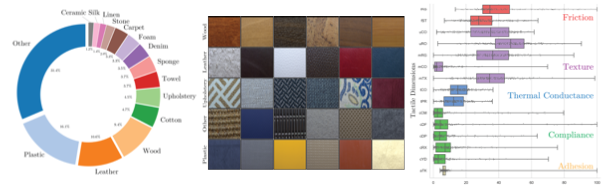
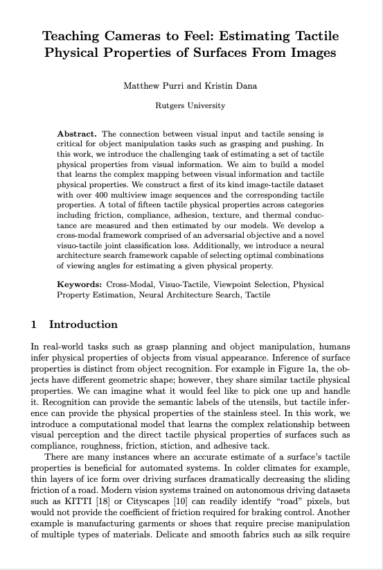
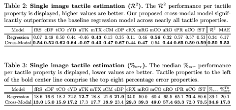
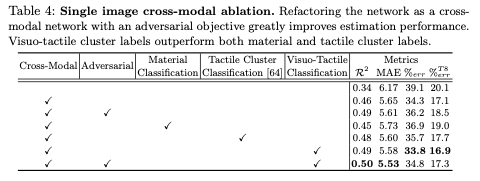
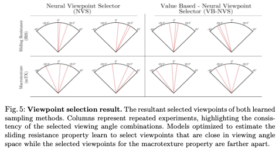

* * *

## Abstract
The connection between visual input and tactile sensing is critical for object manipulation tasks such as grasping and pushing.
In this work, we introduce the challenging task of estimating a set of tactile physical properties from visual information. We aim to build a model that learns the complex mapping between visual information and tactile physical properties. We construct a first of its kind image-tactile dataset with over 400 multiview image sequences and the corresponding tactile properties. A total of fifteen tactile physical properties across categories including friction, compliance, adhesion, texture, and thermal conductance are measured and then estimated by our models. We develop a cross-modal framework comprised of an adversarial objective and a novel visuo-tactile joint classification loss. Additionally, we introduce a neural architecture search framework capable of  selecting optimal combinations of viewing angles for estimating a given physical property.

* * *

## Video (90 seconds)

<table align="center" width="700px">
  <tbody>
    <tr>
      <td align="center" width="700px">
        <center>
          <iframe width="700" height="420" src="https://www.youtube.com/embed/J532toKnly8" frameborder="0" allow="autoplay" allowfullscreen="" align="center"></iframe>
        </center>
      </td>
   </tr>
  </tbody>
</table>

* * *

## Surface Property Synesthesia Dataset



Synesthesia is the production of an experience relating to one sense by a stimulation of another sense. For example, when viewing an image of a hamburger you may unconsciously imagine the taste of the sandwich. In this work, images of surfaces are perceived and the tactile properties of that surface are estimated. To train a model for tactile physical property estimation, we collect a dataset named the Surface Property Synesthesia Dataset (SPS) consisting of pairs of RGB image sequences and tactile measurements. The dataset contains 400+ commonly found indoor material surfaces, including categories such as plastic, leather, wood, denim, and more as shown on the left side of the above Figure. To our knowledge, this dataset contains the largest number of material surfaces of any visuo-tactile dataset, a necessity for learning the complex relation between vision and touch. A majority of the dataset belongs to four of the fifteen material categories. However, each category contains a diverse set of surfaces in terms of both color and pattern as shown in the middle Figure above.

<a href="https://drive.google.com/file/d/1cjrQo2S5RwP0wLOjvY4KNomGaQ8ohgwj/view">[DOWNLOAD DATASET]</a>

* * *
## News Articles
<a href="https://techxplore.com/news/2020-05-tactile-properties-surfaces-images.html">TechXplore</a>
<a href="https://www.newscientist.com/article/2254877-ai-camera-can-tell-what-surfaces-feel-like-with-just-a-glance/">NewScientist</a>

* * *

## Paper (ECCV 2020)


<a href="https://matthewpurri.github.io/Teaching-Cameras-to-Feel">[ECCV]</a>
<a href="https://arxiv.org/pdf/2004.14487.pdf">[arXiv]</a>

If you used or reference our work, please cite our work as follows:
```
@inproceedings{purri2020teaching,
  title={Teaching Cameras to Feel: Estimating Tactile Physical Properties of Surfaces from Images},
  author={Purri, Matthew and Dana, Kristin},
  booktitle={European Conference on Computer Vision},
  pages={1--20},
  year={2020},
  organization={Springer}
}
```

* * *

## Selected Results

### Single Image Tactile Property Estimation


### Multimodal Ablation Study


### Viewpoint Selection Results



* * *

### Acknowledgements
This research was supported by NSF Grant \#1715195. We would like to thank Eric Wengrowski, Peri Akiva, and Faith Johnson for the useful suggestions and discussions.

Tactile measurements were done by SynTouch Inc., with the BioTac Toccare, and purchased by Rutgers.
